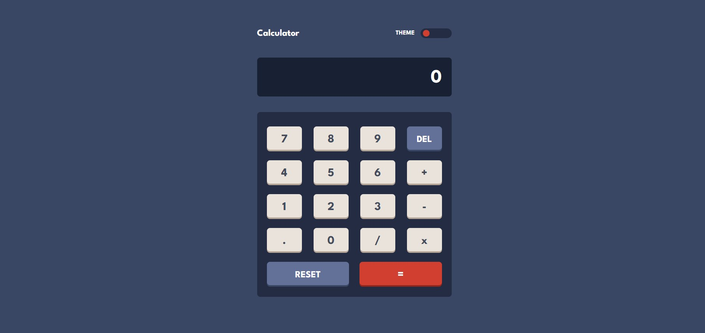
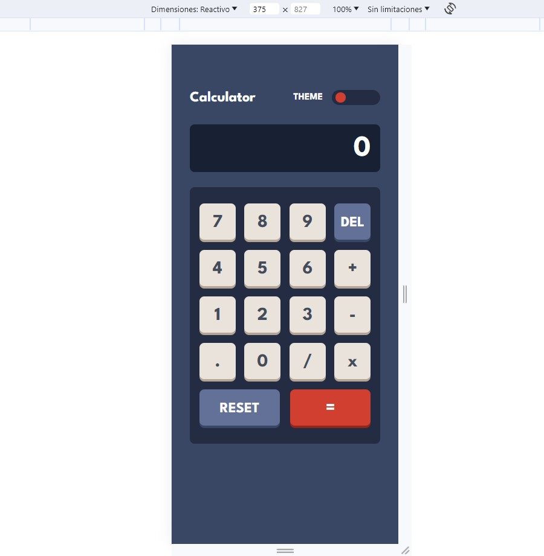
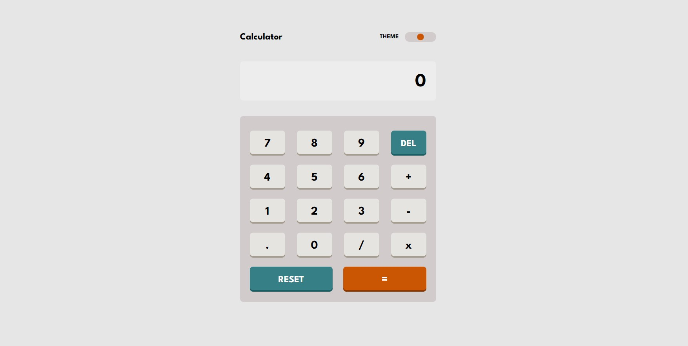
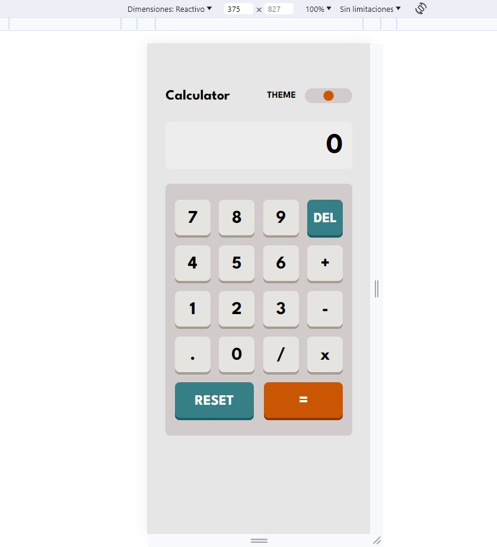
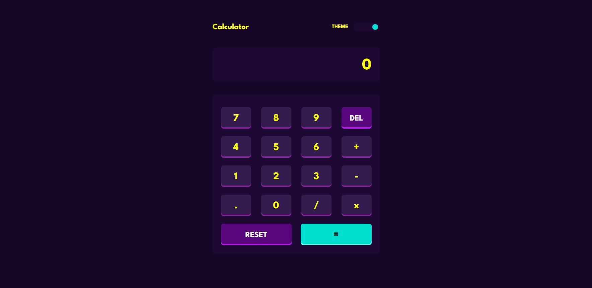
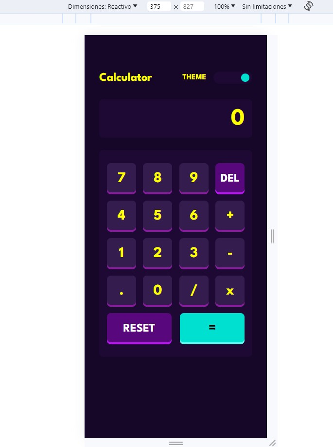

# Frontend Mentor - Calculator App

This is a solution to the [Results Calculator App challenge on Frontend Mentor](https://www.frontendmentor.io/challenges/calculator-app-9lteq5N29). Frontend Mentor challenges help you improve your coding skills by building realistic projects. 

### Links

- Live Site URL: [Results Calculator App](https://front-end-mentor-calculator-app-three.vercel.app/)

### Built with

- JavaScript
- React.js
- Semantic HTML5 markup
- CSS custom properties
- Mobile-first workflow

